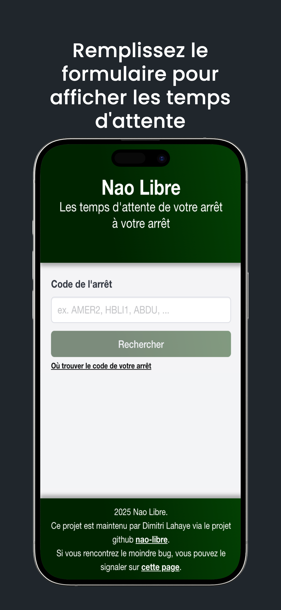

# Nao Libre

Les temps d'attente de votre arrêt à votre arrêt

## Installation

```sh
npm install
```

## Lancer localement

```sh
npm run dev
```

## Usage

Remplissez le formulaire avec le code de votre arrêt. Validez. Et voilà :)

Dans l'idéal, chaque arrêt du réseau Naolib serait pourvu d'un QR Code dirigeant vers la liste des temps d'attente spécifiques de l'arrêt.

Mais pour des raisons évidentes (de coût, de temps, de légalité), je me suis tourné vers l'implémentation d'un formulaire.

Les codes de chaque arrêt peuvent être récupérés via un call API ici [https://open.tan.fr/ewp/arrets.json](https://open.tan.fr/ewp/arrets.json). Mais ils se trouvent surtout imprimés sur chaque fiche horaire aux arrêts de bus / tram.

## Screenshots



